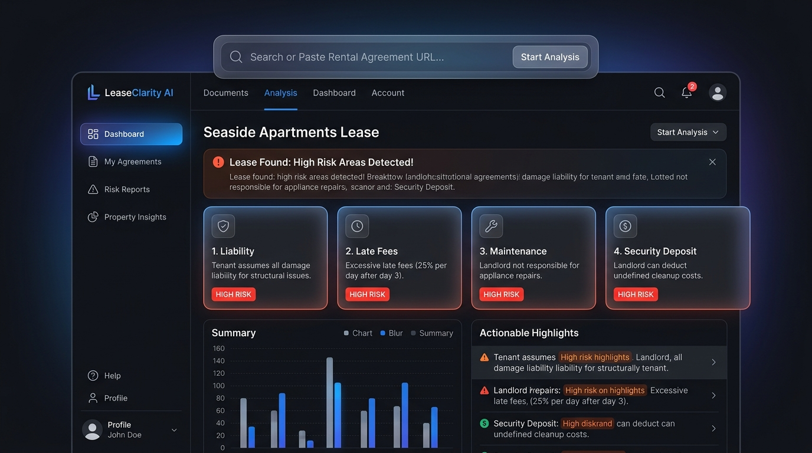

# LeaseClarity

> **AI-Powered Rental Agreement Assistant for First-Time Tenants**  
> *Decodes complex residential leases, spots predatory clauses, answers grounded questions, and generates lawyer consultation checklists.*

[](https://lease-clarity-sigma.vercel.app)
[](https://lease-clarity.onrender.com/api/health)
[](LICENSE)

---

## Overview

Residential leases are frequently packed with dense boilerplate legalese, hidden penalties, and predatory waiver clauses. **LeaseClarity** balances this information asymmetry by translating complex rental agreements into plain, structured English and highlighting critical tenant protections using **Google Gemini 3.1 Flash-Lite**.

> **Disclaimer**: *LeaseClarity is for educational and informational purposes only and does NOT constitute formal legal advice.*

---

## Key Features

- 📑 **Plain-Language Summary**: Instant breakdown of key terms, rent schedules, and tenant obligations.
- 🚨 **Red-Flag Risk Detector**: Categorizes predatory clauses into High, Medium, and Low severity with verbatim contract citations.
- 💬 **Grounded Q&A Engine**: Strict document-bounded question answering with safe refusal policies to prevent hallucinations.
- 📋 **Lawyer Consultation Checklist**: Generates prioritized action sheets and questions for tenant unions or legal aid clinics.
- ⚖️ **Dual-Draft Lease Comparison**: Side-by-side delta analysis to compare original and revised lease agreements.

---

## Interface Preview



---

## Problem Statement & Use Case Alignment

Mapped directly to the official **AI for Legal Assistance & Access** track requirements:

| Challenge Requirement | LeaseClarity Technical Feature | Implementation Module |
| :--- | :--- | :--- |
| **Simplifying complex legal documents** | Plain-Language Lease Summary | `app/services/summarizer.py` |
| **Comparing contracts or policies** | Dual-Draft Lease Comparison | `app/services/comparator.py` |
| **Highlighting clauses, risks, & obligations** | 7-Trap Predatory Red-Flag Detector | `app/services/risk_detector.py` |
| **Answering document-grounded questions** | Verbatim Grounded Q&A Engine | `app/services/qa_engine.py` |
| **Generating actionable outputs** | Lawyer Consultation Checklist | `app/services/lawyer_checklist.py` |

---

## Technical Architecture

Built with a modern decoupled microservices architecture designed for security, privacy, and performance:

- **Frontend**: React 18, Vite, Tailwind CSS, Lucide Icons (Deployed on [Vercel](https://lease-clarity-sigma.vercel.app)).
- **Backend API**: FastAPI (Python 3.11), Pydantic V2, async `pdfplumber`/`pypdf` extraction (Deployed on [Render](https://lease-clarity.onrender.com)).
- **AI Engine**: Google Gemini 3.1 Flash-Lite (`gemini-3.1-flash-lite`) via official `google-genai` Python SDK.

```
[React 18 Frontend (Vercel)] ──► [FastAPI Backend (Render)] ──► [Google Gemini 3.1 Flash-Lite]
```

### Security & Privacy
- **Ephemeral In-Memory Processing**: Uploaded lease documents are processed strictly in RAM buffers and purged immediately.
- **Strict CORS Origin Locking**: Restricts backend API access strictly to the deployed Vercel domain.
- **Zero-Secret Commit**: All environment configuration uses environment variables with clean `.env.example` templates.

---

## Quick Start (Local Development)

### Prerequisites
- Python 3.11+
- Node.js 18+
- Gemini API Key ([Google AI Studio](https://aistudio.google.com/))

### 1. Backend Setup
```bash
cd backend
python -m venv .venv
# On Windows:
.venv\Scripts\activate
# On Unix:
source .venv/bin/activate

pip install -r requirements.txt
cp .env.example .env
# Set GEMINI_API_KEY in .env

python -m uvicorn app.main:app --reload --port 8000
```

### 2. Frontend Setup
```bash
cd frontend
npm install
npm run dev
```

Open `http://localhost:5173` in your browser.

---

## Verification & Testing

Run the full automated test suite (31/31 passed):
```bash
cd backend
python -m pytest -o pythonpath=. ..\tests
```

---

## License

MIT License. Built for the Google Prompt Wars / Hackathon (*AI for Legal Assistance & Access*).
